# Les Bases de Deep Learning 
Dans cette formation, nous allons apprendre les concepts de bases de Deep Learning et les calcules scientifiques

## Perceptron
### Définition

Le perceptron est l'unité de base des réseaux de neurones. Il s'agit d'un modèle de classification binaire, capable de séparer linearement 2 classes de points

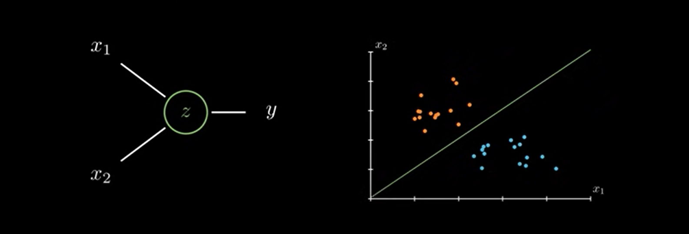

### Exemple

Imaginer qu'on ait deux types de plantes( toxique: y = 1 et non-toxique y = 0).

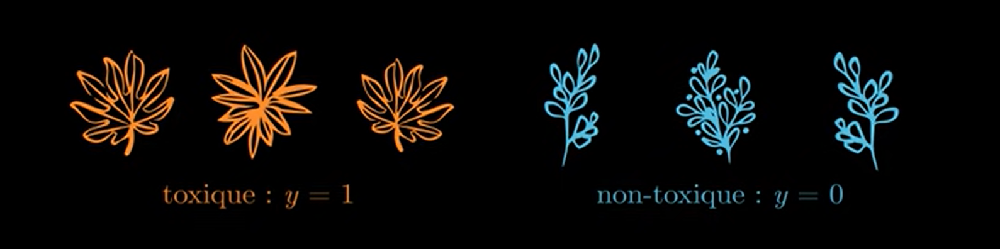

Si un jour, on decide de mesurer les longueurs de ces plantes (x1 et x2) .

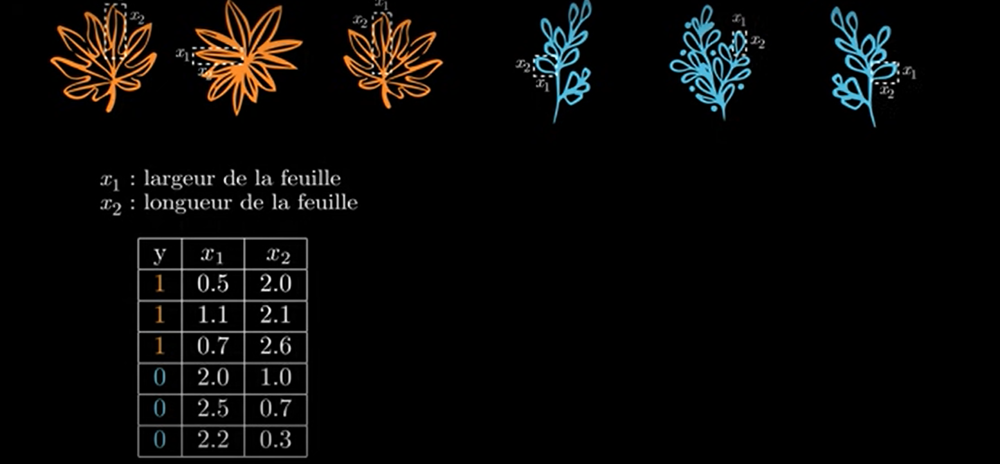

En répresentant les résultat un graphique, on constate que ces plantes régroupées en séparées en deux classes ou groupes. 
On peut donc développer un modèle capable de prédire à quelle classe appartient une future plante en se basant sur cette droite appélé la frontière de décision.

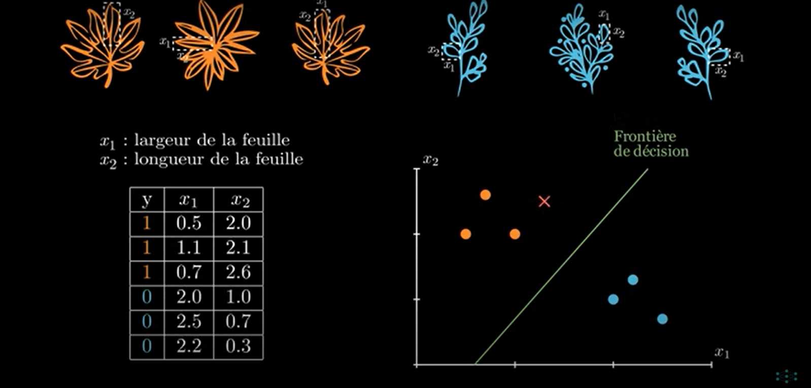

### Modèle Lineare
Pour développer ce modèle, il va falloir l'équation de cette droite.

Pour ça, nous allons développer un modèle lineaire en fournissant nos variables x1 et x2 à un neurones en multipliant chaque entrer du neurones par un poids w dans ce neurone, on va  également faire passer un coefficient complementaire b qu'on appelle le biais.

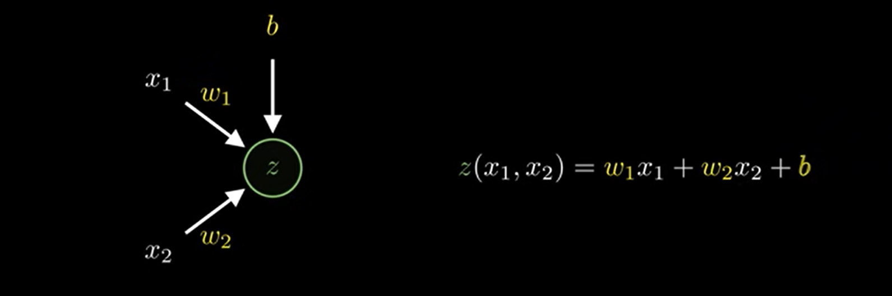

De retour sur notre graphique, on peut colorer les régions où cette fonction nous retourne une valeur positive z>0 et les régions où elle nous retourne une valeur négative z<0.

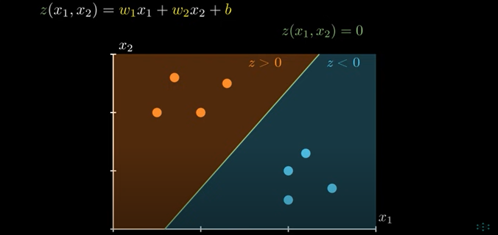

### Reglage des paramètre
Du coup pour prédire à quelle classe appartient une plante il va falloir  régler les paramètre w et b de façon à mieux séparer nos deux classes.

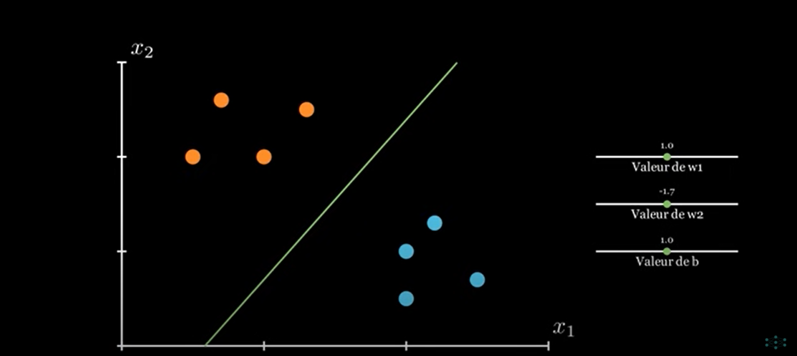

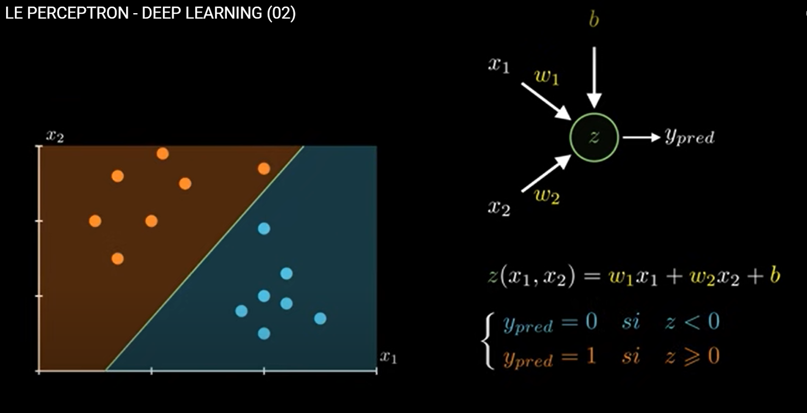

C'est ainsi que fonction un perceptron, le premier neurone de l'histoire de Deep Learning.

## Amélioration
Pour améliorer ce modèle, il sera mieu d'accompagner chaque prédiction d'une probabilité. Plus une plante sera éloingnée de la frontière de décision plus il sera évident qu'elle appartienne à sa classe.

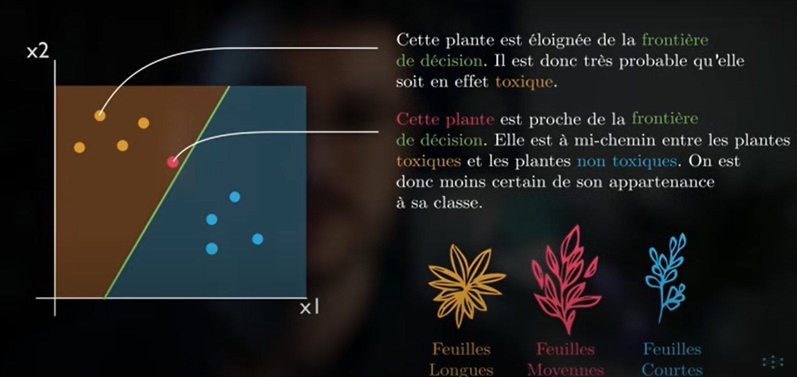

## Fonction d'activation

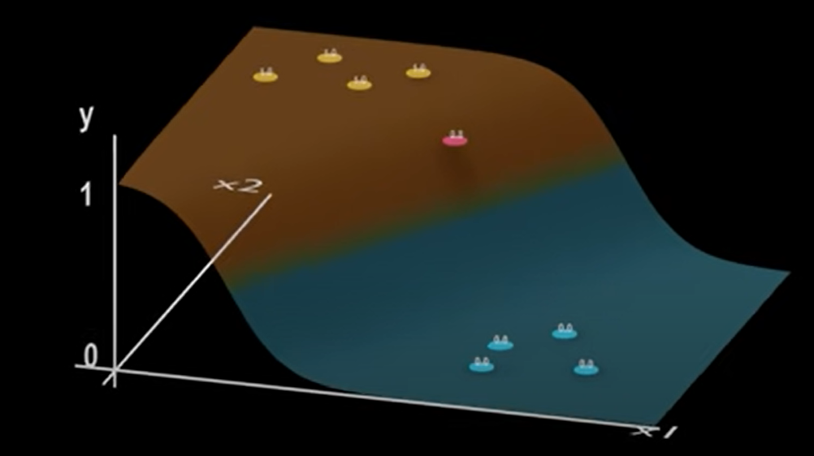 

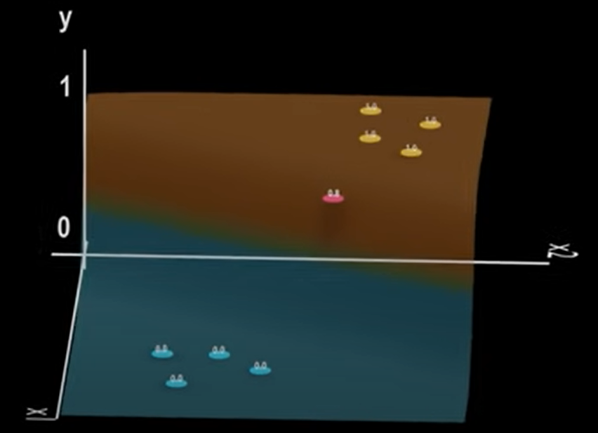

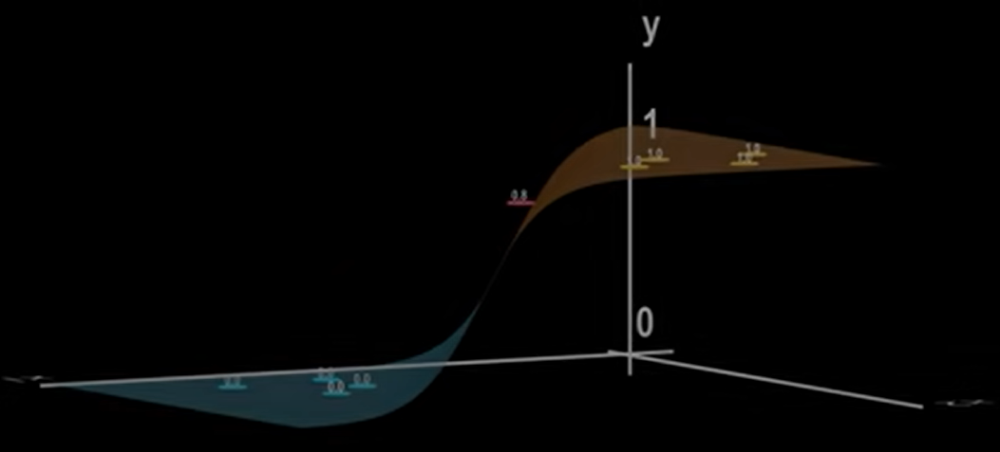

## Fonction sigmoïde

Cette fonction qui permet d'effectuer cette action est appélée la fonction **sigmoïde(Logistique)**.

Cette permet de convertir la sortie z en une probabilité a(z)

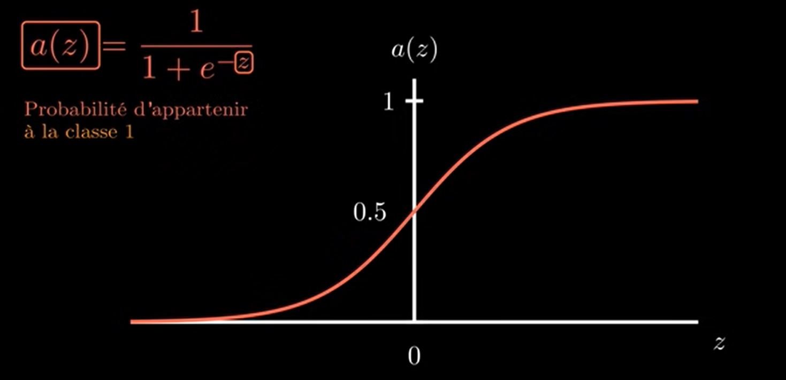
