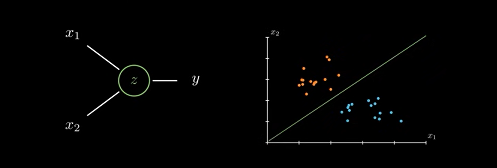
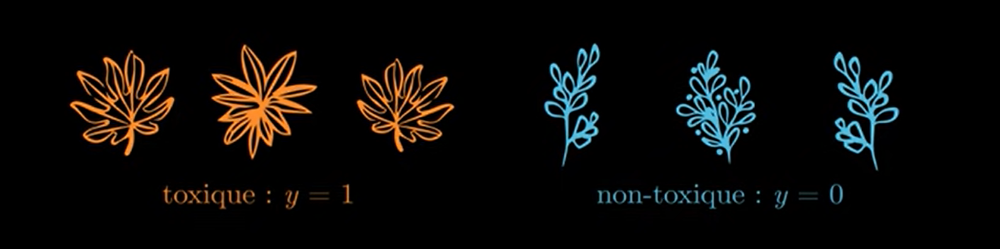
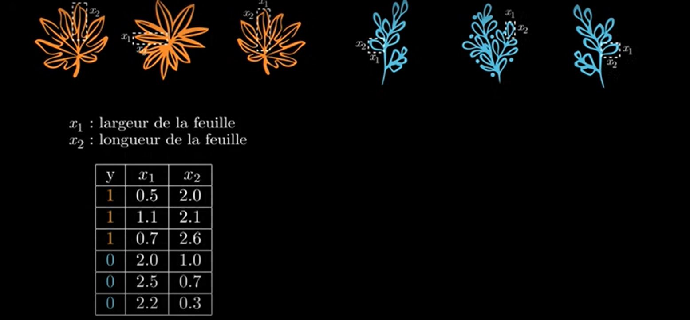
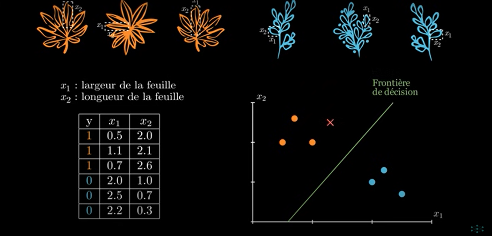
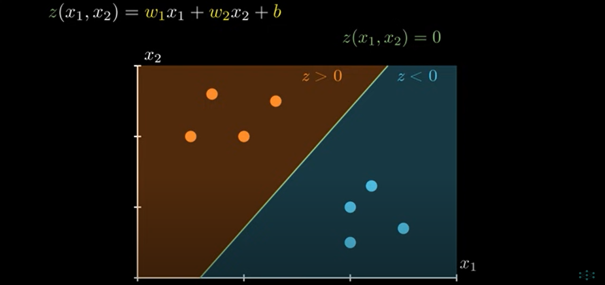
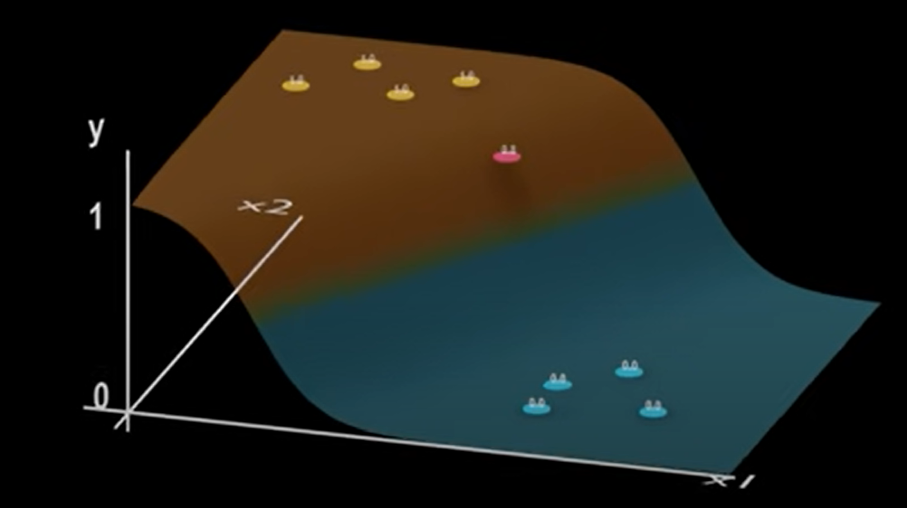
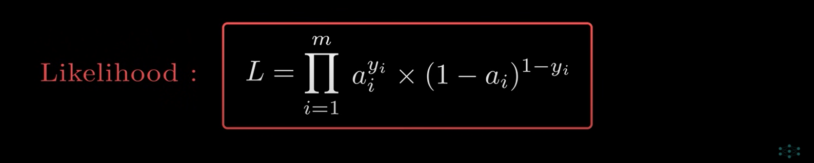

Auteur: Laby Damaro Camara
---
Email: ldamaro98@gmail.com
---
Github: https://github.com/camara94
---
# Les Bases de Deep Learning 
Dans cette formation, nous allons apprendre les concepts de bases de Deep Learning et les calcules scientifiques

## Perceptron
### Définition

Le perceptron est l'unité de base des réseaux de neurones. Il s'agit d'un modèle de classification binaire, capable de séparer linearement 2 classes de points

### Exemple

Imaginer qu'on ait deux types de plantes( toxique: y = 1 et non-toxique y = 0).

Si un jour, on decide de mesurer les longueurs de ces plantes (x1 et x2) .

En répresentant les résultat un graphique, on constate que ces plantes régroupées en séparées en deux classes ou groupes. 
On peut donc développer un modèle capable de prédire à quelle classe appartient une future plante en se basant sur cette droite appélé la frontière de décision.

### Modèle Lineare
Pour développer ce modèle, il va falloir l'équation de cette droite.

Pour ça, nous allons développer un modèle lineaire en fournissant nos variables x1 et x2 à un neurones en multipliant chaque entrer du neurones par un poids w dans ce neurone, on va  également faire passer un coefficient complementaire b qu'on appelle le biais.

De retour sur notre graphique, on peut colorer les régions où cette fonction nous retourne une valeur positive z>0 et les régions où elle nous retourne une valeur négative z<0.

### Reglage des paramètre
Du coup pour prédire à quelle classe appartient une plante il va falloir  régler les paramètre w et b de façon à mieux séparer nos deux classes.

C'est ainsi que fonction un perceptron, le premier neurone de l'histoire de Deep Learning.

## Amélioration
Pour améliorer ce modèle, il sera mieu d'accompagner chaque prédiction d'une probabilité. Plus une plante sera éloingnée de la frontière de décision plus il sera évident qu'elle appartienne à sa classe.

## Fonction d'activation

 

## Fonction sigmoïde

Cette fonction qui permet d'effectuer cette action est appélée la fonction **sigmoïde(Logistique)**.

Cette permet de convertir la sortie z en une probabilité a(z)

## Par exemple 

## La loi de Bernoulli

## Résumé

Pour résumer tout ce qu'on vient de voir, tout ce qui se trouve à l'intérieur d'un réseau de neurone (z = w1 * x1 + w2 * x2 + b), suivi d'une fonction d'activation a(z) = 1 / 1 + e-z qui nous retourne une probabilité suivant la loi de Bernoulli.

## Fonction Coût (MAXIUM DE VRAISEMBLANCE)
En machine Learning une fonction coût(Loss Function), c'est une fonction qui permet de quantifier les **erreurs effctuées** par un modèle. 

Dans notre cas, c'est une fonction qui calcule la différence entre y réelle et y_pred de notre modèle.

## Origine de la fonction coût(demonstration)

### La Vraisemblance

Elle nous indique la plausibilité du modèle vis-à-vis de vraies données.

---
**Analogie :**

Une histoire est vraisemblable lorqu'elle est en accord avec des faits qui se sont vraiment déroulés
---

## Par exemple
Si une plante est existe et elle est toxique c'est à dire **y = 1**

## La Formule de Vraisemblance

* Si le résultat de cette formule est égale à 100% cela veut dire que notre modèle est vraisemblable à 100%
  
    

* Si le résultat de cette formule est égale à 0% cela veut dire que notre modèle est fortement invraisemblable.
    

## Problème de cette formule

En pratique lorsqu'on calcule la vraisemblance des volumes importants de données on se rend compte que le résultat quasiment prèsque égal à zéro (0). Et là ça devient un problème

## Solution 
Pour rémedier à ce problème, on applique la fonction logarithme à la formule de Bernoulli.
Et cela nous donne un résultat plus lisible au paravant.

Ce pendant, on pourrait penser que la fonction logarithme donne un autre sens à notre calcule mais non ce n'est pas le cas car la fonction logarithme est une fonction monotone croissente donc elle conserve l'ordre de nos termes.

Cela signifie que lorsqu'on cherche le maximum de notre vraisemblance, il nous suffira de chercher le maximum de notre vraisemblance et comme vous pouvez le constater dans ce graphique ça retournera le même résultat. Alors par conclusion on peut utiliser le log de la vraisemblance pour continuer notre calcule.

### Demonstration

Ce résultat ressemble beaucoup au résultat de **Log Loss** à la différence de -1/m

Mais ce qu'on a fait là c'est juste le calcule du log de la vraisemblance et une vraisemblance on cherche à la maximiser pour avoir le meilleur modèle possible  le modèle le plus vraisemblable or en mathématique les algorthme de maximisation n'existe pas vraiment à la place on utilise plutôt des algorithmes de minimisation

## Alors
Maintenant vous savez l'origine de notre fonction **Log Loss**

Mais le problème n'est pas là, car maximiser une fonction revient à la fonction -f(x), c'est pourquoi pour maximiser notre fonction on revient minimixer sa fonction négative d'où le signe moins (-) et 1/m c'est un but de normalisation de notre fonction.

## Algorithme de la DESCENTE DE GRADIENT

La Descente de gradient est l'un des algorithmes les plus utilisés en **Machine Learning** et en **Deep Learning**.

Il consite à ajuster les paramètres W et b de façon à manimiser les erreurs du modèle et, c'est à dire à **minimiser la fonction coût  (Log Loss)**.

Pour ça, il faut determiner comment est ce que cette fonction varie en fonction des différents paramètres.

C'est pourquoi on calcule le **Gradient** (ou la **dérivée**) de la **Fonction Coût**.

* Si la dérivée est négative ça nous indique la fonction diminue quand **W** augmente qu'il va falloir donc augmenter **W** si on veut réduire nos erreurs.

* Si la dérivée est positive ça nous indique la fonction augmente quand **W** augmente qu'il va falloir donc diminuer **W** si on veut réduire nos erreurs.
  

* Pour faire cela, on va utiliser la formule suivante:

* En repétant cette formule on obtient cette figure, d'où le nom **Descente Gradient**

* Alors que ça marche il faut que notre fonction soit convexe.

## Exercice

